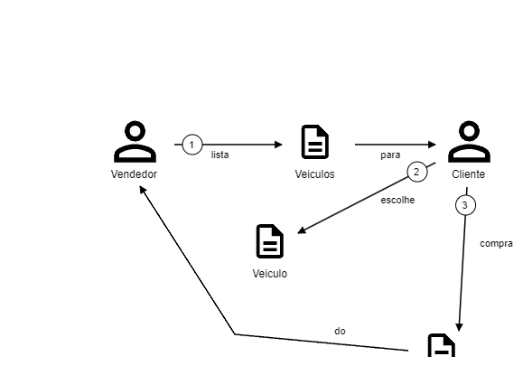
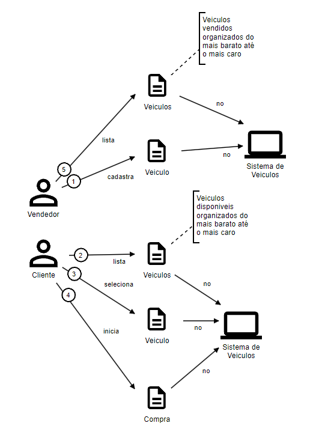

# Introdução
Uma empresa de revenda de veículos automotores nos contratou pois quer implantar uma
plataforma que funcione na internet, sendo assim, temos que criar a plataforma. O time de UX já
está criando os designs, e ficou sob sua responsabilidade criar a API. O desenho da solução
envolve as seguintes necessidades do negócio:
- Cadastrar um veículo para venda (Marca, modelo, ano, cor e preço);
- Editar os dados do veículo;
- Efetuar a venda de um veículo (CPF da pessoa que comprou, data da venda);
- Listagem de veículos à venda, ordenada por preço, do mais barato para o mais caro;
- Listagem de veículos vendidos, ordenada por preço, do mais barato para o mais caro.
  
É necessário registrar todas as datas de alteração das informações relacionadas ao veículo,
seja de cadastro, edição e venda.
Importante: nem todos os campos e funcionalidades necessárias para atender os
requisitos estão descritos acima, por isso a modelagem é fundamental para entender como
resolver o problema e entender o que precisa ser feito para que a solução funcione.

---

# Domínio da empresa de veículos automotores
> **Venda**

# DDD
Controle de gerenciamento/venda de veículos

## Sudbominio Principal
- Venda de veículos
- Gerenciamento dos veiculos

## Subdominio Genérico
- Listagem de veiculos a venda
- Listagem de veiculos vendidos

## Subdominio Suporte


## Linguagem ubíqua

### Dicionario
- Cliente/Client: Toda pessoa que inicia o processo de compra de um veiculo.
- Veiculo/Car: Todo o veiculo comercializado pela empresa
- Venda: Processo de venda de um veiculo para um cliente;
- Compra/Order: Processo de compra de um veiculo por um cliente;
- Vendedor: Todo funcionário da empresa responsável por gerenciar os veiculos.

## Event Storming
> Acesse https://miro.com/app/board/uXjVLWyqN2E=/?share_link_id=69846078093

## Domain Storytelling

### Dominio Puro


### Dominio Digitalizado


----

# Executando o projeto
- Instalar dependencias
```shelll
npm i
docker compose up
```
## Como rodar locamente
- Acesse a pasta backend no README tem as instruções.

## Como testar
- Segue abaixo collection com todos os endpoints disponíveis para teste.


# API
## Rotas
> Documentacao das rotas disponiveis, elas podem ser acessadas tambem nessa collection (https://documenter.getpostman.com/view/483864/2sAXxP9CRu)
> 
### Veiculo / Car
- Path `/car`
    - **POST**: Cria um novo veiculo
      - **HTTP Code**:
        - 200 - cadastrado corretamente
        - 422 - payload com dados invalidos
  - **Payload**
```json
{
    "brand": "GM",
    "model": "S10",
    "year": "2024",
    "color": "Cinza",
    "price": 124000.99,
    "status": "SOLD"
}
```
- **Resposta**
```json
{
    "carId": "2a6c487e-cf69-40d6-8fc9-3ebace33f2b6",
    "brand": "GM",
    "model": "S10",
    "year": "2024",
    "color": "Cinza",
    "price": 124000.99,
    "status": "AVAILABLE"
}
```
- Path `/car/{{id}}`
    - **PATH**: Edita um veiculo
      - **HTTP Code**:
        - 200 - alterado corretamente
        - 422 - payload com dados invalidos
  - **Payload**
```json
{
  "brand": "GM",
  "model": "S10",
  "year": "2024",
  "color": "Cinza",
  "price": 124000.99,
  "status": "SOLD"
}
```
- **Resposta**
```json
{
  "carId": "75a3f789-d49e-4431-9294-05cbf9d819d8",
  "brand": "GM",
  "model": "S10",
  "year": "2024",
  "color": "Cinza",
  "price": 124000.99,
  "status": "SOLD"
}
```
- Path `/car/{{id}}`
    - **DELETE**: Deleta um veiculo
      - **HTTP Code**:
        - 200 - deletou o veiculo com sucesso
        - 422 - produto nao existe
- **Resposta**
```json
{
 "success": true
}
```
- Path `/car/{{id}}`
    - **GET**: Busca um veiculo
      - **HTTP Code**:
        - 200 - encontrou o veiculo com sucesso
        - 422 - veiculo nao existe
- **Resposta**
```json
{
  "carId": "75a3f789-d49e-4431-9294-05cbf9d819d8",
  "brand": "GM",
  "model": "S10",
  "year": "2024",
  "color": "Cinza",
  "price": 124000.99,
  "status": "SOLD"
}
```
- Path `/car/status/AVAILABLE`
    - **GET**: Lista todos os veiculos disponiveis do mais barato para mais caro 
      - **HTTP Code**:
        - 200 - retornou dados
- **Resposta**
```json
[
 {
  "carId": "75a3f789-d49e-4431-9294-05cbf9d819d8",
  "brand": "GM",
  "model": "S10",
  "year": "2024",
  "color": "Cinza",
  "price": 124000.98,
  "status": "AVAILABLE"
},
{
  "carId": "8e39a766-e6f8-4a78-a140-7c470028c43d",
  "brand": "GM",
  "model": "S10",
  "year": "2024",
  "color": "Cinza",
  "price": 124000.99,
  "status": "AVAILABLE"
}
]
```
- Path `/veiculo/status/SOLD`
    - **GET**: Lista todos os veiculos vendidos do mais caro para mais barato
      - **HTTP Code**:
        - 200 - retornou dados
- **Resposta**
```json
[
{
  "carId": "75a3f789-d49e-4431-9294-05cbf9d819d8",
  "brand": "GM",
  "model": "S10",
  "year": "2024",
  "color": "Cinza",
  "price": 124000.98,
  "status": "SOLD"
},
{
  "carId": "8e39a766-e6f8-4a78-a140-7c470028c43d",
  "brand": "GM",
  "model": "S10",
  "year": "2024",
  "color": "Cinza",
  "price": 124000.99,
  "status": "SOLD"
}
]
```

### Venda / Order
- Path `/order`
    - **POST**: Cria uma nova venda
      - **HTTP Code**:
        - 200 - cadastrado corretamente
        - 403 - payload com dados invalidos
  - **Payload**
```json
{
  "carId": "5b48ef06-1b8c-11ee-8fe5-023afac12b88",
  "cpf": "185.612.250-68",
  "total": 124000.00
}
```
- **Resposta**
```json
{

    "orderId": "df0dd781-ac9d-4cc3-a789-b31d0b9a4b33",
    "carId": "88b653f1-8d96-4ddc-ba65-e718398ef9e4",
    "total": 124000,
    "cpf": "185.612.250-68",
    "createAt": "2024-10-07T15:06:55.068Z"

}
```
- Path `/order`
    - **GET**: Lista todas as vendas
      - **HTTP Code**:
        - 200
- **Resposta**
```json
[

  {
      "orderId": "df0dd781-ac9d-4cc3-a789-b31d0b9a4b33",
      "carId": "88b653f1-8d96-4ddc-ba65-e718398ef9e4",
      "cpf": "185.612.250-68",
      "total": "124000",
      "createAt": "2024-10-07T15:06:55.068Z",
      "car": {
          "carId": "88b653f1-8d96-4ddc-ba65-e718398ef9e4",
          "price": 2.99,
          "status": "SOLD",
          "brand": "GM",
          "model": "S10",
          "color": "Cinza",
          "year": {
              "value": "2024"
          }
      }
  }

]
```