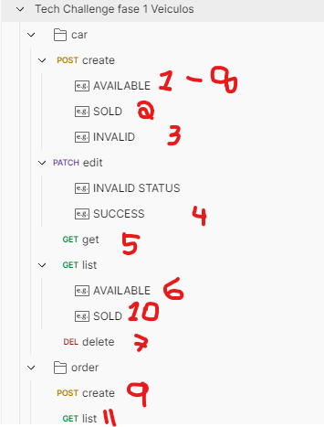

# Orientação para avaliador.
- configurar arquivo .env do projeto com os dados do banco de dados, deixei ele pronto no .env.example então basta copiar e renomear para .env
- rodar npm install
- rodar npm run start
- agora ele vai ta com o banco de dados e aplicacao rodando, a porta esta no .env

## API
- na documentação da pasta principal tem a url da collection do postman online. Mas tambem dentro dessa pasta existe dois arquivos:
  - collection.json - Tem a collection
  - collection-env.json - Tem as variaveis do postman necessárias para rodar a collection.
  
### Ordem de chamada
> Recomendo usar a seguinte ordem


# Stack
- Typescript
- Docker

# Development

```shell
npm install
npm run dev
```

# Build

```shell
npm run build 
```